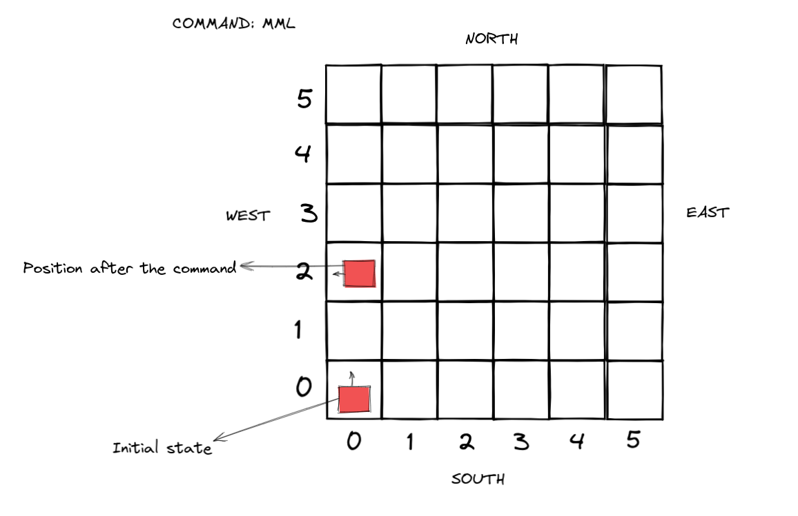

# Spirit mars kotlin, What is it?
This is a simple rest application based on a code challenge which I did a long time ago,
the intention of this application is only to get to know koltin a little by getting more familiar with its syntax.

Challenge:

    A team of robots will be send to mars in a exploration mission, the Mars has a retangular terrain which will be navigate by
    the robots with a front camera, the image will be sended later on back to earth.

    The position of the robot is represented by (x,y) and for an letter which indicates the front of the robot which has the camera 
    position (NORTH, SOUTH, EAST e WEST) for example a valid robot position would be (0 , 0, N) this indicates that the robot is at 
    the moment in left button of the terrain and pointed to the north.

    In order to controll the robot NASA send a command which contains ‘L’, ‘R’ and ‘M’ the letter ‘L’ and ‘R’ make the robot rotate 90° to the rigth or left
    and the letter 'M' make the robot move to move 1 step to the front

Example:
    if the Robot is in the position (0,0,N) and the command "MML" is executed the robot will be located at the position (0,2,W)
    

Requirements:
- The terrain has only 5x5 dimension
- The robot always starts at the coordinate (0,0,N)
- The navigation through the terrain is being done by rest api example POST "/rest/mars/MML"
- As a return of the rest is necessary to inform the new potion example: POST "/rest/mars/MML" should lead to (0,2,W)
- The robot should not go out of the terrain (5x5) in this case the rest needs to return 404
- Is not necessary to store the state
